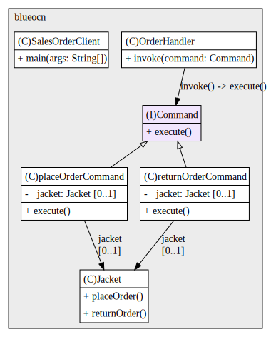

## Java Design Patterns: Behavioral

---

# Challenge
Let's have a look at our next exercise. In this one, we've got a sales order app, and the exercise is going to be to complete the remaining functionality using the command pattern, so, let's take a look at the app. 

This has a class called sales order clients, so this class has a main method and in here there are two order handler objects. One for placing orders, and the other for returning orders. If I look inside, the order handler class, I can see it has a single method called in book, which doesn't do anything at the moment. There is also a third class called jackets, this has two methods, place order and the return order. The functionality for ordering and returning a jacket is in here. 

If get back to the sales order clients, I can see that there is a field of typed jackets in here. This exercise is to implement command pattern, so that when the involved method is called on the order handler's object in the main method, the correct functionality gets caught. You should have separate commands for placing orders and returning orders. The idea is that this sales order app could easily be used for ordering different types of items, not just for jackets. 

You shouldn't just do jackets.place orders anywhere in here, because we don't want this sales order client class, to be coupled to that functionality. The solution to your exercise can be very similar to the example shown in the previous video. Am excepting this might take you 30 minutes or so, so good luck and have fun.

# Solution

In this architecture, SalesOrderClient is the entry point. It creates a Jacket (the receiver) and two concrete commands— PlaceOrderCommand and ReturnOrderCommand—each wrapping that Jacket instance. Both commands implement the Command interface by providing an execute() method that delegates to jacket.placeOrder() or jacket.returnOrder().

OrderHandler acts as the invoker: it accepts any Command and calls execute() without knowing which action will run. This indirection decouples client code (SalesOrderClient) and UI logic from business logic in Jacket. Adding a new operation requires only a new Command class, honoring the Open/Closed Principle. Commands are self-contained and testable in isolation, can be queued or logged by OrderHandler, and lay the groundwork for advanced features like undo/redo or macro-recording—all without altering existing classes.